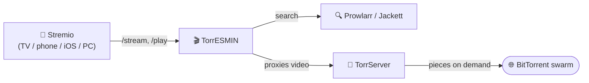

<p align="center">
  
</p>

<h1 align="center">🎬 TorrESMIN</h1>
<p align="center"><em>Torrent: Entertainment Should Make Inclusion Natural</em></p>

<p align="center">
  <a href="LICENSE"></a>
  
  
  <a href="https://github.com/juniorterin/torresmin/issues"></a>
</p>

<p align="center"><strong><a href="README.md">🇧🇷 Português</a> · [🇺🇸 English](#)</strong></p>

A **self-hosted** Stremio addon that searches torrents through your own **Prowlarr**/**Jackett** and streams them straight from your own **[TorrServer](https://github.com/YouROK/TorrServer)** — with real seeking (jump forward/back without re-downloading from scratch), no paid debrid service and no qBittorrent required.

---

## Table of contents

- [Why TorrESMIN](#why-torresmin)
- [Features](#features)
- [Architecture](#architecture)
- [Running it](#running-it)
- [Environment variables](#environment-variables)
- [Setting it up in Stremio](#setting-it-up-in-stremio)
- [Curated catalogs](#curated-catalogs)
- [Admin panel](#admin-panel)
- [Privacy and security](#privacy-and-security)
- [Contributing](#contributing)
- [License](#license)

---

## Why TorrESMIN

- **🚀 High speed, no queue** — it's your own server pulling from peers, no bandwidth limit shared with other users of a third-party service.
- **🎞️ Streams without waiting for the full download** — TorrServer prioritizes torrent pieces by read position, so you can watch and seek to any point in the video while it's still downloading.
- **🖥️ Real server-grade performance** — runs on a server sized by you, without the bandwidth/quality caps of free third-party debrid/cache services.
- **📺 Built for TV, phones, and Android TV/boxes** — those devices don't have a decent torrent client built in; desktop Stremio already solves this on its own, so the real win is off the desktop.
- **🍎 The only way to watch torrents on iOS** — Apple doesn't allow torrent apps on the App Store. Since all the heavy lifting runs on your server, Stremio on iPhone/iPad just needs to play a regular video.
- **🔒 You control access** — per-person keys, locked to an IP on first use; nothing passes through third-party servers.

## Features

- **Searches** movies, series and anime across every indexer configured in your Prowlarr (or Jackett).
- **Filters and prioritizes** by language, keyword, indexer and quality — however you configure it.
- **Streams** through TorrServer, which downloads and reprioritizes torrent pieces on demand as you watch.
- **Formats** each stream's name and description your way, with a token-based template builder (size, resolution, seeders, language, release group, etc.).
- **Sorts/groups** results by whatever priority you pick: keyword, language, resolution, quality, size, seeders or indexer.
- **Curated catalogs** (Criterion Collection, Sight & Sound Top 100, IMDb Top 250, film movements, world cinema and more) right on the Stremio home screen — see [Curated catalogs](#curated-catalogs).
- **Recent-releases catalog**, optional, fed by your own indexers' RSS feeds.
- **Admin panel** (`/admin`) to manage access keys and catalogs without touching code — see [Admin panel](#admin-panel).

There's no Real-Debrid, TorBox, StremThru or raw P2P magnet support — the addon was deliberately trimmed down to do one thing well: Prowlarr/Jackett searching, TorrServer delivering.

## Architecture



TorrServer is **never** exposed directly to the internet — every video byte flows through the addon, which is what checks the access key. See [`.claude/docs/stream-pipeline.md`](.claude/docs/stream-pipeline.md) for the full `/stream` → `/play` flow.

## Running it

The recommended way is Docker Compose. The repository ships a ready-to-use [`docker-compose.yaml`](docker-compose.yaml) with Redis, Prowlarr and TorrServer:

```bash
git clone https://github.com/juniorterin/torresmin.git
cd torresmin

# Fill in JACKETT_API_KEY, ADDON_PUBLIC_URL and ACCESS_TOKEN
cp .env.example .env

docker compose up -d
```

The addon listens on port `7860`. Put a reverse proxy in front (Coolify, Traefik, Nginx...) if exposing it to the internet, and point `ADDON_PUBLIC_URL` at the matching public address. **TorrServer doesn't need to (and shouldn't) be exposed to the internet** — the addon is the only thing that talks to it directly (see [Privacy and security](#privacy-and-security)).

> **Developing locally?** Use `docker compose -f docker-compose.local.yaml up -d` — a separate stack with hot-reload, see [`.claude/docs/dev-workflow.md`](.claude/docs/dev-workflow.md).

### Environment variables

| Variable | Required | Description |
|---|---|---|
| `JACKETT_URL` | yes | Prowlarr or Jackett URL |
| `JACKETT_API_KEY` | yes | Prowlarr/Jackett API key |
| `TS_URL` | yes | Internal TorrServer URL (only needs to be reachable by the addon, never from the internet) |
| `TS_USER` / `TS_PASS` | no | TorrServer basic auth, if protected |
| `REDIS_URL` | recommended | Search cache — without it, falls back to an in-memory cache lost on every restart |
| `ADDON_PUBLIC_URL` | recommended | Public addon URL, behind a proxy/hosting provider |
| `ACCESS_TOKEN` | no | Locks operational/debug routes (`/api/indexers`, `/api/test`, `/api/metrics`) against unauthorized use |
| `ADMIN_PASSWORD` | no | Enables the [admin panel](#admin-panel) at `/admin` — without it, the area is unreachable |
| `CONFIG_DATA_DIR` / `CONFIG_DATABASE_URL` | no | Where to persist the `cfg_...` configs generated by the UI — local file or Postgres |
| `TMDB_API_KEY` / `TMDB_BEARER_TOKEN` | no | Enriches titles/synopsis (pt-BR) in the catalog |
| `RSS_CATALOG_INDEXERS` | no | Which indexers feed the recent-releases catalog |
| `SCRAP_MANIFEST_URLS` | no | Other Stremio addon manifests to merge into Prowlarr/Jackett results |
| `ALLOWED_ORIGINS` | no | CORS-allowed origins (default: all) |

The full commented list lives in [`.env.example`](.env.example).

## Setting it up in Stremio

1. With the addon running, open `http://YOUR_SERVER:7860/configure` in a browser.
2. **Indexers** — pick which indexers and categories (movies/series/anime) take part in searches.
3. **Filters** — priority language, boost keywords, priority indexers, result limits.
4. **Formatting** — build how each stream's name and description look in Stremio using tokens like `{resolution}`, `{size}`, `{seeders}`, `{language}`; a live preview shows the real rendered result, column by column, just like Stremio.
5. **Sorting** — set the priority order of ranking criteria (the first one in the list dominates, effectively acting as "group by").
6. **Catalogs** — toggle the recent-releases catalog and pick which [curated catalogs](#curated-catalogs) show up on the home screen.
7. **Install** — name the addon, generate the link and install it in Stremio (or copy the manifest link).

Revisiting the generated `/cfg_.../configure` link reloads the saved config for editing.

### Available formatting tokens

`{addon}` `{title}` `{year}` `{season}` `{resolution}` `{quality}` `{codec}` `{size}` `{seeders}` `{language}` `{audio}` `{visual}` `{group}` `{indexer}`

Each template line is independent: if every token it references comes back empty for a given result (say, `{audio}` when the release doesn't state one), the whole line disappears — no conditional logic needed.

## Curated catalogs

Beyond search, TorrESMIN can show hand-picked movie lists right on the Stremio home screen: **Criterion Collection**, **Sight & Sound Top 100**, **IMDb Top 250**, film movements (Nouvelle Vague, Cinema Novo, Italian Neorealism...), cinema by country, director retrospectives and more.

Each catalog is a list of IMDb IDs, seeded via script and editable afterwards from the [admin panel](#admin-panel):

```bash
node scripts/seedCatalogs.js
```

See [`.claude/docs/catalogs-and-rss.md`](.claude/docs/catalogs-and-rss.md) for how it works (and a roadmap of ideas for new catalogs).

## Admin panel

With `ADMIN_PASSWORD` set, `/admin` opens a panel to:

- **Access keys** — create/revoke per-person keys, with optional expiry and automatic IP locking on first use.
- **Curated catalogs** — create, rename, delete catalogs and add/remove titles (by IMDb ID) without touching code or restarting the addon.

See [`.claude/docs/auth.md`](.claude/docs/auth.md) to understand how this fits with the project's other auth layers.

## Privacy and security

- **Self-hosted** — your API keys and configuration never pass through third-party servers.
- **`ACCESS_TOKEN`** locks operational/debug routes against unauthorized access.
- **Per-viewer access keys** (created in `/admin`) gate who can search/watch — TorrServer is never exposed directly: every stream request is proxied through the addon, which requires a valid key before forwarding anything to it.
- Guards against path traversal, ReDoS, and restricted CORS.

## Contributing

Issues and pull requests are welcome! Before sending a PR:

```bash
npm install
npm test
```

The project uses Node's built-in test runner (`node:test`) — no extra framework. [`.claude/docs/`](.claude/docs) has in-depth guides on each part of the system (streaming pipeline, persistence, auth, catalogs...) — worth reading the relevant one before touching that area.

## License

[MIT](LICENSE) — use, modify and redistribute freely, keeping the credits.

---

*Built by the community, for the community.* 🍿
