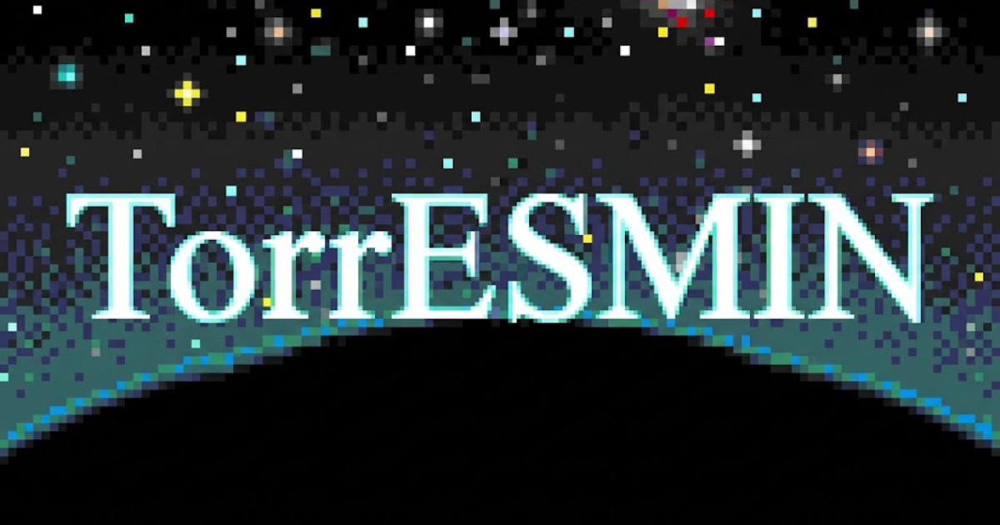
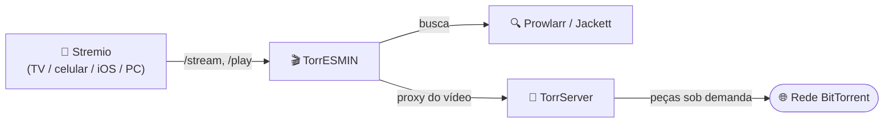

<p align="center">
  
</p>

<h1 align="center">🎬 TorrESMIN</h1>
<p align="center"><em>Torrent: Entertainment Should Make Inclusion Natural</em></p>

<p align="center">
  <a href="LICENSE"></a>
  
  
  <a href="https://github.com/juniorterin/torresmin/issues"></a>
</p>

<p align="center"><strong>[🇧🇷 Português](#) · <a href="README.en.md">🇺🇸 English</a></strong></p>

Addon de Stremio **auto-hospedado** que busca torrents no seu **Prowlarr**/**Jackett** e transmite direto pelo seu próprio **[TorrServer](https://github.com/YouROK/TorrServer)** — com seek de verdade (avançar/voltar sem re-baixar o arquivo do zero), sem depender de serviço debrid pago nem de qBittorrent.

---

## Sumário

- [Por que TorrESMIN](#por-que-torresmin)
- [Funcionalidades](#funcionalidades)
- [Arquitetura](#arquitetura)
- [Como rodar](#como-rodar)
- [Variáveis de ambiente](#variáveis-de-ambiente)
- [Configurando no Stremio](#configurando-no-stremio)
- [Catálogos curados](#catálogos-curados)
- [Painel administrativo](#painel-administrativo)
- [Privacidade e segurança](#privacidade-e-segurança)
- [Contribuindo](#contribuindo)
- [Licença](#licença)

---

## Por que TorrESMIN

- **🚀 Alta velocidade, sem fila** — é o seu servidor puxando os peers, sem limite compartilhado com outros usuários de um serviço de terceiros.
- **🎞️ Toca sem esperar baixar tudo** — o TorrServer prioriza as peças do torrent pela posição de leitura, então dá pra assistir e pular pra qualquer ponto do vídeo enquanto ele ainda está baixando.
- **🖥️ Qualidade de servidor de verdade** — roda num servidor dimensionado por você, sem os limites de banda/qualidade de serviços gratuitos de debrid/cache de terceiros.
- **📺 Feito pra TV, celular e Android TV/boxes** — esses dispositivos não têm um cliente de torrent decente embutido; o Stremio de PC/notebook já resolve isso sozinho, então o ganho maior é fora do desktop.
- **🍎 A única forma de assistir torrent no iOS** — a Apple não permite apps de torrent na App Store. Como todo o trabalho pesado roda no seu servidor, o Stremio no iPhone/iPad só precisa reproduzir um vídeo normal.
- **🔒 Você controla o acesso** — chaves por pessoa, travadas por IP no primeiro uso; nada passa por servidores de terceiros.

## Funcionalidades

- **Busca** filmes, séries e animes em todos os indexadores configurados no seu Prowlarr (ou Jackett).
- **Filtra e prioriza** por idioma, palavra-chave, indexador e qualidade — do jeito que você configurar.
- **Transmite** pelo TorrServer, que baixa e reprioriza os pedaços do torrent sob demanda conforme você assiste.
- **Formata** o nome e a descrição de cada stream do seu jeito, com um construtor de template baseado em tokens (tamanho, resolução, seeders, idioma, grupo de release, etc.).
- **Ordena/agrupa** os resultados pela prioridade que você escolher: palavra-chave, idioma, resolução, qualidade, tamanho, seeders ou indexador.
- **Catálogos curados** (Criterion, Sight & Sound, IMDb Top 250, movimentos cinematográficos, cinema mundial e mais) direto na home do Stremio — veja [Catálogos curados](#catálogos-curados).
- **Catálogo de lançamentos recentes**, opcional, alimentado pelo RSS dos seus próprios indexadores.
- **Painel administrativo** (`/admin`) pra gerenciar chaves de acesso e catálogos sem tocar em código — veja [Painel administrativo](#painel-administrativo).

Não há suporte a Real-Debrid, TorBox, StremThru ou magnet puro P2P — o addon foi enxugado de propósito pra fazer bem uma coisa: Prowlarr/Jackett buscando, TorrServer entregando.

## Arquitetura



O TorrServer **nunca** é exposto direto pra internet — todo byte de vídeo passa pelo addon, que é quem checa a chave de acesso. Veja [`.claude/docs/stream-pipeline.md`](.claude/docs/stream-pipeline.md) pro fluxo completo `/stream` → `/play`.

## Como rodar

A forma recomendada é com Docker Compose. O repositório já traz um [`docker-compose.yaml`](docker-compose.yaml) pronto com Redis, Prowlarr e TorrServer:

```bash
git clone https://github.com/juniorterin/torresmin.git
cd torresmin

# Preencha JACKETT_API_KEY, ADDON_PUBLIC_URL e ACCESS_TOKEN
cp .env.example .env

docker compose up -d
```

O addon sobe na porta `7860`. Coloque um proxy reverso (Coolify, Traefik, Nginx...) na frente se for expor pra internet, e aponte `ADDON_PUBLIC_URL` pro endereço público correspondente. **O TorrServer não precisa (e não deve) ser exposto pra internet** — o addon é o único ponto de contato com ele (ver [Privacidade e segurança](#privacidade-e-segurança)).

> **Desenvolvendo localmente?** Use `docker compose -f docker-compose.local.yaml up -d` — stack separada com hot-reload, veja [`.claude/docs/dev-workflow.md`](.claude/docs/dev-workflow.md).

### Variáveis de ambiente

| Variável | Obrigatória | Descrição |
|---|---|---|
| `JACKETT_URL` | sim | URL do Prowlarr ou Jackett |
| `JACKETT_API_KEY` | sim | API key do Prowlarr/Jackett |
| `TS_URL` | sim | URL interna do TorrServer (só precisa ser alcançável pelo addon, nunca pela internet) |
| `TS_USER` / `TS_PASS` | não | Basic auth do TorrServer, se protegido |
| `REDIS_URL` | recomendada | Cache de buscas — sem isso, cai para cache em memória (perdido a cada reinício) |
| `ADDON_PUBLIC_URL` | recomendada | URL pública do addon, atrás de proxy/hosting |
| `ACCESS_TOKEN` | não | Trava rotas operacionais/debug (`/api/indexers`, `/api/test`, `/api/metrics`) contra uso não autorizado |
| `ADMIN_PASSWORD` | não | Ativa o [painel administrativo](#painel-administrativo) em `/admin` — sem ela, a área fica inacessível |
| `CONFIG_DATA_DIR` / `CONFIG_DATABASE_URL` | não | Onde salvar as configurações `cfg_...` geradas pela UI — arquivo local ou Postgres |
| `TMDB_API_KEY` / `TMDB_BEARER_TOKEN` | não | Enriquece título/sinopse em pt-BR no catálogo |
| `RSS_CATALOG_INDEXERS` | não | Quais indexers alimentam o catálogo de lançamentos recentes |
| `SCRAP_MANIFEST_URLS` | não | Manifests de outros addons Stremio pra somar aos resultados do Prowlarr/Jackett |
| `ALLOWED_ORIGINS` | não | Origens permitidas por CORS (padrão: todas) |

A lista completa, com comentários, está em [`.env.example`](.env.example).

## Configurando no Stremio

1. Com o addon rodando, acesse `http://SEU_SERVIDOR:7860/configure` no navegador.
2. **Indexadores** — escolha quais indexadores e categorias (filmes/séries/anime) participam da busca.
3. **Filtros** — idioma prioritário, palavras-chave de boost, indexadores prioritários, limites de resultado.
4. **Formatação** — monte como o nome e a descrição de cada stream aparecem no Stremio, usando tokens como `{resolution}`, `{size}`, `{seeders}`, `{language}`; uma prévia ao vivo mostra o resultado real, coluna a coluna, igual ao Stremio.
5. **Ordenação** — defina a ordem de prioridade dos critérios de ranking (o primeiro da lista domina, funcionando como "agrupar por").
6. **Catálogos** — liga/desliga o catálogo de lançamentos recentes e escolhe quais [catálogos curados](#catálogos-curados) aparecem na home.
7. **Instalação** — dê um nome ao addon, gere o link e instale no Stremio (ou copie o link do manifest).

Voltar em `/cfg_.../configure` com o link gerado recarrega a configuração salva pra edição.

### Tokens de formatação disponíveis

`{addon}` `{title}` `{year}` `{season}` `{resolution}` `{quality}` `{codec}` `{size}` `{seeders}` `{language}` `{audio}` `{visual}` `{group}` `{indexer}`

Cada linha do template é independente: se todos os tokens dela vierem vazios pro resultado atual (por exemplo, `{audio}` quando o release não informa áudio), a linha inteira some — sem precisar de lógica condicional.

## Catálogos curados

Além da busca, o TorrESMIN pode mostrar listas de filmes hand-picked direto na home do Stremio: **Criterion Collection**, **Sight & Sound Top 100**, **IMDb Top 250**, movimentos cinematográficos (Nouvelle Vague, Cinema Novo, Neorrealismo italiano...), cinema por país, retrospectivas de diretor e mais.

Cada catálogo é uma lista de IDs do IMDb, semeada via script e editável depois pelo [painel administrativo](#painel-administrativo):

```bash
node scripts/seedCatalogs.js
```

Detalhes de como funciona (e o roteiro de ideias pra novos catálogos) estão em [`.claude/docs/catalogs-and-rss.md`](.claude/docs/catalogs-and-rss.md).

## Painel administrativo

Com `ADMIN_PASSWORD` definida, `/admin` abre um painel pra:

- **Chaves de acesso** — criar/revogar chaves por pessoa, com validade opcional e trava automática por IP no primeiro uso.
- **Catálogos curados** — criar, renomear, excluir catálogos e adicionar/remover títulos (por ID do IMDb) sem precisar editar código nem reiniciar o addon.

Veja [`.claude/docs/auth.md`](.claude/docs/auth.md) pra entender como isso se encaixa com as outras camadas de autenticação do projeto.

## Privacidade e segurança

- **Auto-hospedado** — suas chaves de API e configurações não passam por servidores de terceiros.
- **`ACCESS_TOKEN`** trava rotas operacionais/debug contra acesso não autorizado.
- **Chaves de acesso por pessoa** (criadas em `/admin`) travam quem pode buscar/assistir — o TorrServer nunca é exposto diretamente: todo pedido de stream é reencaminhado pelo addon, que exige uma chave válida antes de repassar qualquer coisa pra ele.
- Validações contra *path traversal*, *ReDoS* e CORS restrito.

## Contribuindo

Issues e pull requests são bem-vindos! Antes de mandar um PR:

```bash
npm install
npm test
```

O projeto usa o test runner nativo do Node (`node:test`) — sem framework extra. A pasta [`.claude/docs/`](.claude/docs) tem guias aprofundados sobre cada parte do sistema (pipeline de streaming, persistência, autenticação, catálogos...) — vale a pena ler o guia da área antes de mexer nela.

## Licença

[MIT](LICENSE) — use, modifique e redistribua à vontade, mantendo os créditos.

---

*Desenvolvido pela comunidade, para a comunidade.* 🍿
